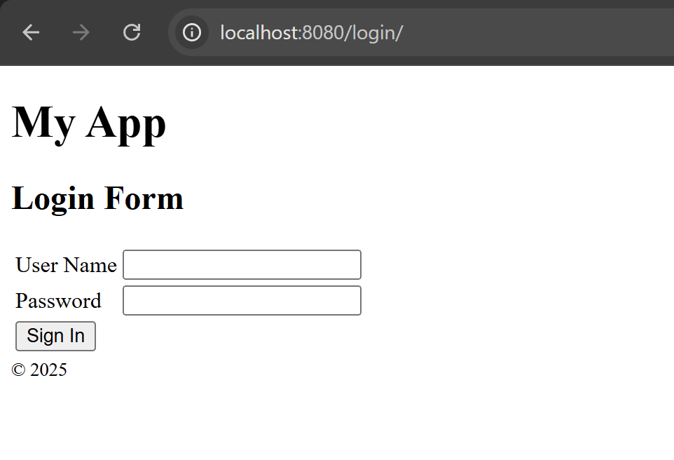
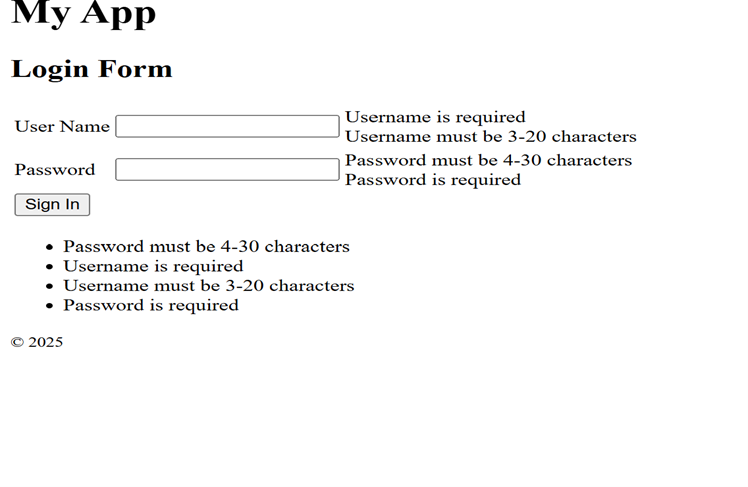
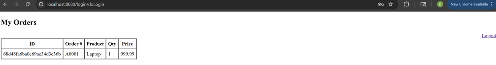
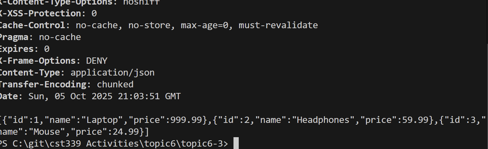
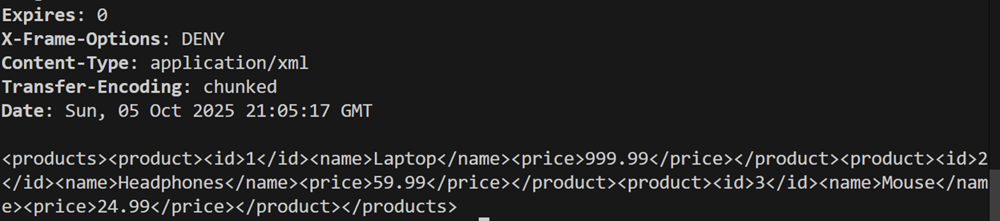
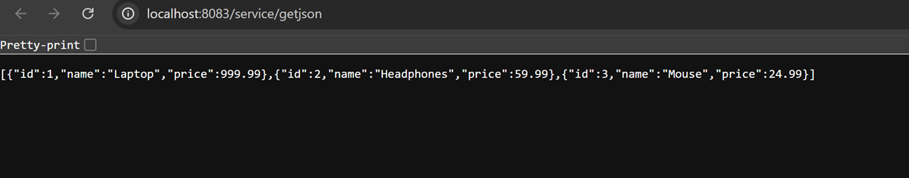
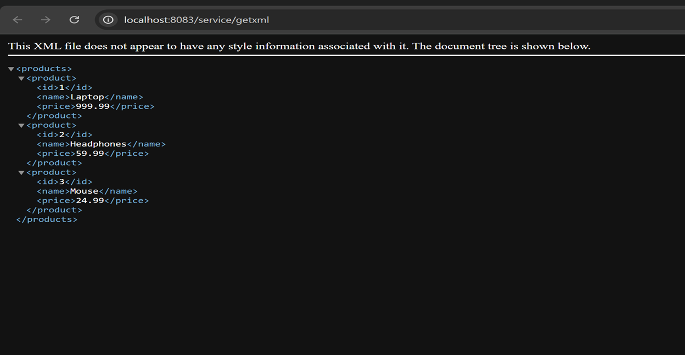
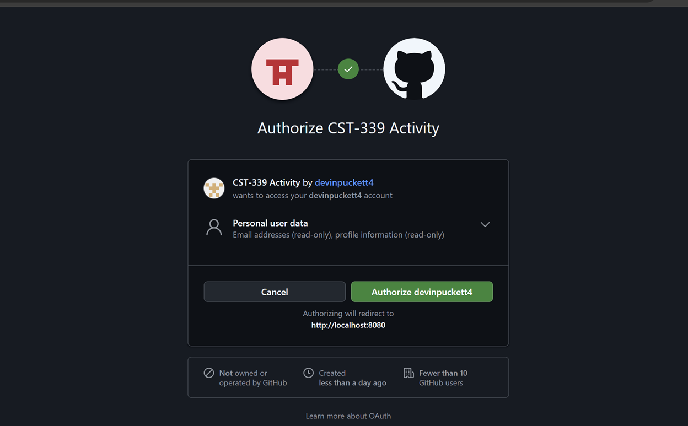
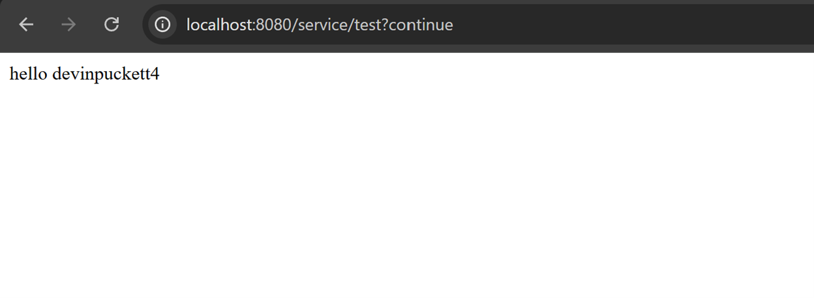

**Name:Devin Puckett**  
**Course:Cst-339**  
**Date:09/25/2025** 

**Professor:Bobby Estey**

---

## - Shows Login Page

This is my custom Spring Security login page for Topic 6-1. When I try to open a protected page, I’m redirected here at http://localhost:8080/login. The form posts my username and password to Spring Security, which validates the credentials and then sends me back to the page I originally asked for. It shows that form-based auth is working and that my app is using my own login view instead of the default one.

---

## -  Shows Login Credentials

This screenshot shows my login form with validation errors. I tried to submit empty/invalid values, and Spring MVC/Thymeleaf displayed the rules: username must be 3–20 characters and password must be 4–30 characters. The messages appear next to each field and again in a summary list, so the user knows exactly what to fix.
It proves the server-side form validation is wired up and prevents bad input before authentication runs.

---

## -  Order Page

This screenshot shows the post-login “My Orders” page after a successful sign-in.
I’m redirected to /login/doLogin, and the app displays my order data in a table pulled from the database. You can see a sample order for a Laptop, which confirms the view is binding and rendering correctly. There’s also a “Logout” link on the right, showing session-based access is active once authenticated.

---

## - Json Through  Terminal 

This screenshot shows my terminal after calling the secured JSON endpoint with valid credentials. I used curl with Basic Auth to hit /getjson, and the server returned Content-Type: application/json along with a list of products and their prices. The headers are visible, and the JSON array renders correctly. This confirms the endpoint is protected and responds with the expected serialized data when I’m authenticated.

---

## - Xml Through Terminal
---

This screenshot shows my terminal after calling the secured /getxml endpoint with valid Basic Auth. The headers confirm the response is Content-Type: application/xml and include standard security headers. The body is an XML payload with a <products> root and three <product> entries (Laptop 999.99, Headphones 59.99, Mouse 24.99). This verifies the endpoint is protected and correctly serializes the data to XML when I’m authenticated.

---
## - Xml Through Terminal

This screenshot shows my terminal after calling the secured /getxml endpoint with valid Basic Auth. The headers confirm the response is Content-Type: application/xml and include standard security headers. The body is an XML payload with a <products> root and three <product> entries. This verifies the endpoint is protected and correctly serializes the data to XML when I’m authenticated.

---
## - Json Web	

This is my browser hitting http://localhost:8083/service/getjson. Since I’m authenticated, the endpoint returns a 200 with an application/json payload. The body is a JSON array of three products with id, name, and price fields. This confirms the secured JSON API is working and serializing the data correctly.

---

## - Xml Web

This is my browser on http://localhost:8083/service/getxml after logging in. The endpoint returns an application/xml response with a <products> root and three <product> items. Each product has <id>, <name>, and <price> fields (Laptop 999.99, Headphones 59.99, Mouse 24.99). It shows the secured XML API is working and the data matches what I get from the JSON endpoint.

---

## - GitHub Auth

This is the GitHub OAuth consent screen that pops up when I hit my secured endpoint. It shows my app requesting read-only access to my basic user data. When I click Authorize devinpuckett4, GitHub sends me back to http://localhost:8080 with an auth code, and Spring Security exchanges it for a token to log me in. Seeing this screen confirms my client ID/secret and callback URL are set up correctly and the OAuth2 SSO flow is working.

---

## - GitHub Signed In

This is the secured /service/test endpoint after I signed in with GitHub.
Spring Security injected the authenticated Principal, so the REST method prints “hello devinpuckett4,” which confirms OAuth2 SSO worked end-to-end. If I weren’t logged in, this same URL would have redirected me to the GitHub consent screen first. So this page is my proof that the access token was accepted and my GitHub username was read successfully.

---

## - Conclusion
Overall, this activity pulled everything together for me. I built a Spring Boot app that talks to MongoDB, cleaned up the controllers and repository wiring, and got the Orders UI and REST endpoints returning the right data. I locked things down with Spring Security using a simple form login, verified good vs. bad credentials, and then added OAuth2 SSO with GitHub so the /service/test endpoint greets me by my GitHub username. Along the way I had to fix some real-world gotchas, conflicting routes, bad field names, and type mismatches, so I feel a lot more comfortable debugging Boot apps now. In the end, the app runs clean, the secured endpoints work, and I understand both basic auth and OAuth2 in Spring. 
